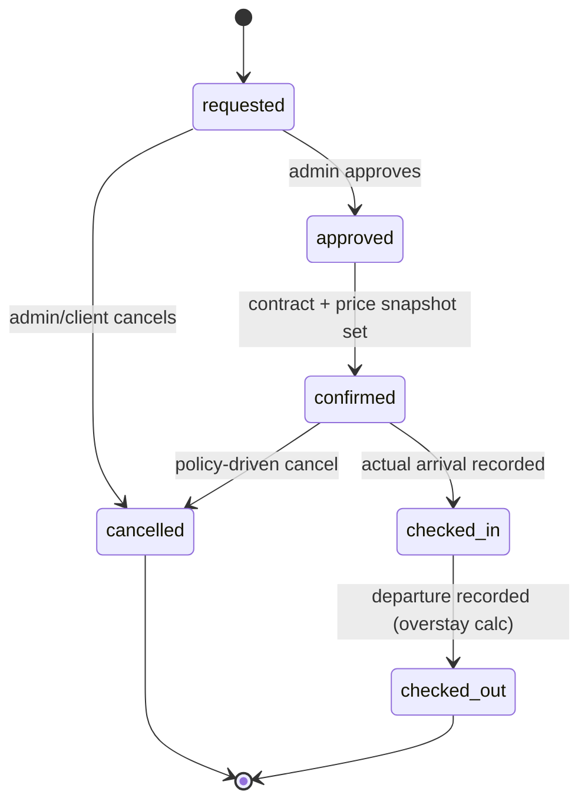
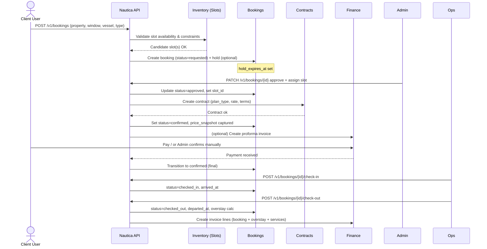

# Booking Workflow & Lifecycle

## Client flow (self-service)

1. **Register/Login** → verify email if required.
2. **Create Vessel** (minimal particulars).
3. **Request Booking**: pick property, date/time window, vessel, booking type; optional notes.
4. System validates **dimension constraints** against available slots. If no slot chosen, status=`requested` and goes to admin queue.
5. If slot chosen and rules pass, create **hold** until admin approval or payment (configurable `settings.booking.hold_minutes`).
6. Client can **request services** linked to booking (or standalone) → pending pricing.

## Admin flow

1. **Review queue** of `requested` bookings → assign slot (or reject with reason from `app_types: cancel_reason`).
2. On approve/confirm: compute **price snapshot** (based on booking type & duration), set status=`confirmed`.
3. Optionally issue **proforma invoice**; on payment or manual confirm → finalize.
4. **Check-in/out**: record timestamps; compute overstay → add charge line.

## States (config-driven)

* `booking_status`: requested, approved, confirmed, cancelled, checked_in, checked_out
* `service_status`: requested, scheduled, completed, cancelled


---

## System overview (Users ⇄ Slots ⇄ Bookings ⇄ Contracts)

```mermaid
flowchart LR
  subgraph Clients
    CUser[Client User]
  end

  subgraph Admins
    AUser[Admin User]
  end

  subgraph Inventory[Inventory & Scheduling]
    Prop[Property]
    Block[Block]
    Zone[Zone]
    Slot[(Slot)]
  end

  subgraph BookingCtx[Booking]
    Req[Booking Request]
    Hold[Hold (expires)]
    Booking[(Booking)]
    Events[[Booking Events]]
  end

  subgraph ContractCtx[Contract & Billing]
    Contract[(Contract Plan)]
    PriceSnap[[Price Snapshot]]
    Invoice[(Invoice)]
  end

  CUser -- create --> Vessel[Vessel]
  CUser -- request --> Req
  Req -->|validate dims & window| Slot
  Slot -- if available --> Hold
  Hold -->|assign & approve| Booking
  AUser -- approve/assign --> Booking
  Booking --> Contract
  Contract --> PriceSnap
  PriceSnap --> Invoice
  Booking --> Events
  Inventory --> Slot
  Prop --> Block --> Zone --> Slot
```

**Notes**

* **Clients** can request without choosing a specific slot; the system either proposes candidates or queues for admin assignment.
* **Admins** approve and assign the final slot; **Contract** is attached to the booking to define plan & base rate.
* **Price Snapshot** is captured at confirmation; **admins may override** before issuing the invoice.

---

## Booking life-cycle (state machine)



**Automatic transitions**

* **Hold expiry** → revert to `requested` (slot released) if not approved within `settings.booking.hold_minutes`.
* **Overstay** charge added during `checked_out` transition if `now > slot.end_at`.

---

## Sequence (happy path)



---

## Data linkages (minimal)

| Entity       | Key links                                                                                       |
| ------------ | ----------------------------------------------------------------------------------------------- |
| **User**     | `organization_id` (nullable for admins), creates **Vessel**, **Booking**                        |
| **Vessel**   | `organization_id` (owner), referenced by **Booking**, **ServiceRequest**                        |
| **Slot**     | `zone_id` → `block_id` → `property_id`; assigned to **Booking**                                 |
| **Booking**  | links: `slot_id`, `vessel_id`, `organization_id`, `booking_type_id`, `status_id`, `contract.id` |
| **Contract** | `booking_id`, `plan_type_id`, `rate`, `terms`, `allow_price_override`                           |
| **Invoice**  | `booking_id` (optional), line items from booking base, overstay, services                       |

**Pricing rule**

* Default = calculated from **Contract** (`plan_type`, `rate`, duration).
* **Override**: Admin may edit the **price\_snapshot** before issuing invoice.

---

## Failure & edge cases

* **Constraint mismatch** (vessel LOA/beam/draft > slot limits) → reject with reason.
* **Overlapping slot** attempt → conflict error; suggest alternatives.
* **Hold expired** before approval → slot released, booking returns to `requested`.
* **No-show**: not checked in within configured grace → mark and apply fee (type in `app_types`).
* **Standalone service**: allowed if `organization_id` + `vessel_id` present, `booking_id` nullable.

---

## Admin schedule view (operational)

* Filters: property/block/zone/slot, date range, status.
* Actions from calendar cell: assign/move booking (re-validate), quick check-in/out, add service.
* Color coding (suggested via `app_types.extra.color`): requested (grey), approved (blue), confirmed (green), checked\_in (purple), checked\_out (neutral), cancelled (red).

```

